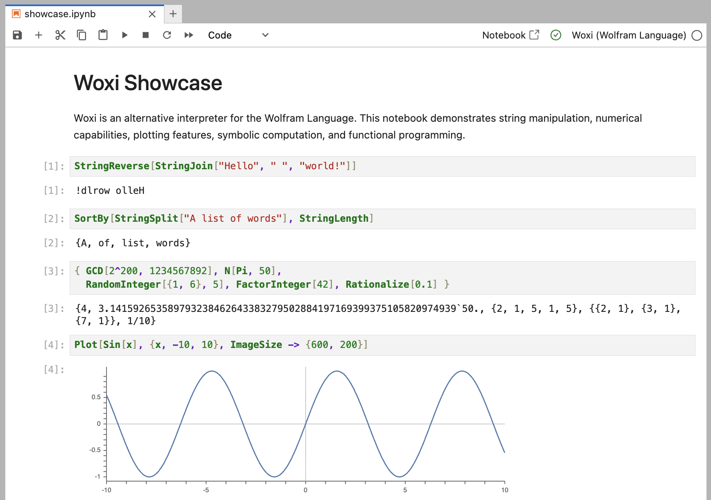

# Woxi

An interpreter for the Wolfram Language powered by Rust.


## Features

The initial focus is to implement a subset of the Wolfram Language
so that it can be used for CLI scripting and Jupyter notebooks.
For example:

```wolfram
#!/usr/bin/env woxi

(* Print the square of 5 random integers between 1 and 9 *)
RandomInteger[{1, 9}, 5] // Map[#^2&] // Map[Print]
```

It has full support for Jupyter Notebooks including graphical output:



> [!TIP]
> **Try it out yourself in our
> [JupyterLite instance](https://woxi.ad-si.com/jupyterlite/lab/index.html?path=showcase.ipynb)!**

Check out the [CLI tests](./tests/cli) directory
to see all currently supported commands and their expected output.
All tests must pass with Woxi and WolframScript.

Also check out the [functions.csv](./functions.csv) file
for a list of all Wolfram Language functions and their implementation status.

Woxi runs faster than WolframScript as there is no overhead of starting a kernel
and verifying its license.


## Installation

You can easily install it with [Rust's cargo](https://doc.rust-lang.org/cargo/):

```sh
cargo install woxi
```

### From Source

If you want to build Woxi from source, you need to have Rust installed.
You can get it from [rust-lang.org](https://www.rust-lang.org/tools/install).

Clone the repository, build the project, and install it:

```sh
git clone https://github.com/ad-si/Woxi
cd Woxi
make install
```


## Usage

You can use the interpreter directly from the command line:

```sh
woxi eval "1 + 2"
# 3
```

```sh
woxi eval 'StringJoin["Hello", " ", "World!"]'
# Hello World!
```

Or you can run a script:

```sh
woxi run tests/scripts/hello_world.wls
```


### Jupyter Notebook

You can also use Woxi in Jupyter notebooks.
Install the kernel with:

```sh
woxi install-kernel
```

Then start the Jupyter server:

```sh
cd examples && jupyter lab
```

Or simply use our
[JupyterLite instance](https://woxi.ad-si.com/jupyterlite/lab/index.html?path=showcase.ipynb).
It runs fully self-contained in your browser and no data is send to the cloud.


## CLI Comparison With [WolframScript]

[WolframScript]: https://www.wolfram.com/wolframscript/index.php.en

Woxi | WolframScript
--- | ---
`woxi eval "1 + 2"` | `wolframscript -code "1 + 2"`
`woxi run script.wls` | `wolframscript script.wls`
`woxi repl` | `wolframscript`


## Contributing

Contributions are very welcome!
Please feel free to submit a Pull Request.


### Testing

To run the test suite:

```sh
make test
```
