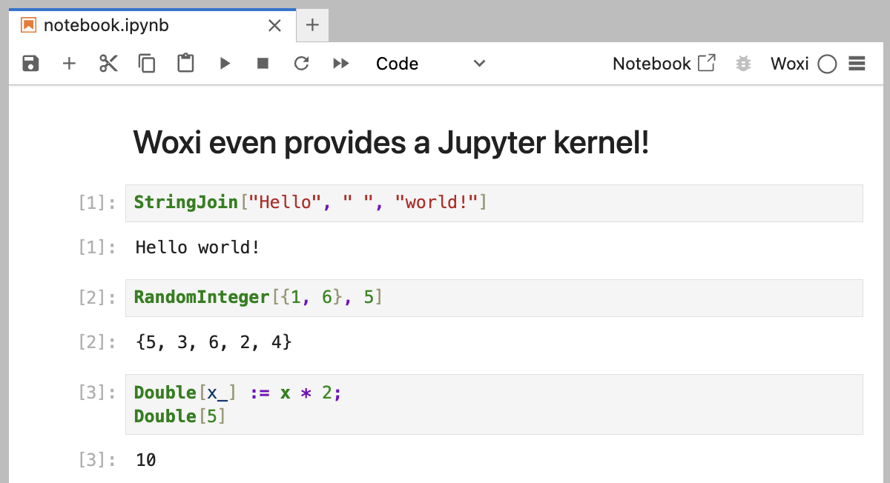

# Woxi

A Rust-based interpreter for a subset of the Wolfram Language.


## Features

The initial focus is to implement a subset of the Wolfram Language
so that it can be used for CLI scripting and Jupyter notebooks.
For example:

```wolfram
#!/usr/bin/env woxi

(* Print 5 random integers between 1 and 6 *)
Print[RandomInteger[{1, 6}, 5]]
```



Check out the [CLI tests](./tests/cli) directory
to see all currently supported commands and their expected output.
All tests must pass with Woxi and WolframScript.

Check out the [functions.csv](./functions.csv) file
for a list of all Wolfram Language functions and their implementation status.

Woxi runs faster than WolframScript as there is no overhead of starting a kernel
and verifying its license.


## Installation

To use Woxi, you need to have [Rust's cargo](https://doc.rust-lang.org/cargo/)
installed on your system.

```sh
cargo install woxi
```

### From Source

If you want to build Woxi from source, you need to have Rust installed.
You can get it from [rust-lang.org](https://www.rust-lang.org/tools/install).

Clone the repository, build the project, and install it:

```sh
git clone https://github.com/ad-si/Woxi
cd Woxi
make install
```


## Usage

You can use the interpreter directly from the command line:

```sh
woxi eval "1 + 2"
# 3
```

```sh
woxi eval 'StringJoin["Hello", " ", "World!"]'
# Hello World!
```

Or you can run a script:

```sh
woxi run tests/cli/hello_world.wls
```


### Jupyter Notebook

You can also use Woxi in Jupyter notebooks.
Install the kernel with:

```sh
woxi install-kernel
```

Then start the Jupyter server:

```sh
cd examples && jupyter lab
```


## CLI Comparison With [WolframScript]

[WolframScript]: https://www.wolfram.com/wolframscript/index.php.en

Woxi | WolframScript
--- | ---
`woxi eval "1 + 2"` | `wolframscript -code "1 + 2"`
`woxi run script.wls` | `wolframscript script.wls`
`woxi repl` | `wolframscript`


## Contributing

Contributions are very welcome!
Please feel free to submit a Pull Request.


### Testing

To run the test suite:

```sh
make test
```


## Related

- [CodeParser] - Parse Wolfram Language as AST or CST.
- [Mastika] - Rust-based implementation of Wolfram Mathematica.
- [MMA Clone] - Simple Wolfram Language clone in Haskell.
- [TS Wolfram] - Toy Wolfram Language interpreter in TypeScript.
- [Wolfram JS Frontend] - Open-source notebook interface for Wolfram Language.
- [Wolfram Parser] - Wolfram Language parser in Rust.
- [wolfram-ast] - A Wolfram Language parser written in pure Rust.
- [wolfram-exchange] - Wolfram exchange format with Rust.
- [wolfram-expr] - Representing Wolfram Language expressions in Rust.
- [Wolfram-Language-Parser] - Wolfram Language parser in Java.

[CodeParser]: https://github.com/WolframResearch/codeparser
[Mastika]: https://crates.io/crates/mastika
[MMA Clone]: https://github.com/mrtwistor/mmaclone
[TS Wolfram]: https://github.com/coffeemug/ts-wolfram
[Wolfram JS Frontend]: https://github.com/JerryI/wolfram-js-frontend
[Wolfram Parser]: https://github.com/oovm/wolfram-parser
[wolfram-ast]: https://crates.io/crates/wolfram-ast
[wolfram-exchange]: https://github.com/oovm/wolfram-exchange
[wolfram-expr]: https://github.com/WolframResearch/wolfram-expr-rs
[Wolfram-Language-Parser]: https://github.com/halirutan/Wolfram-Language-Parser
