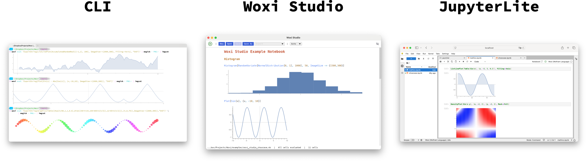
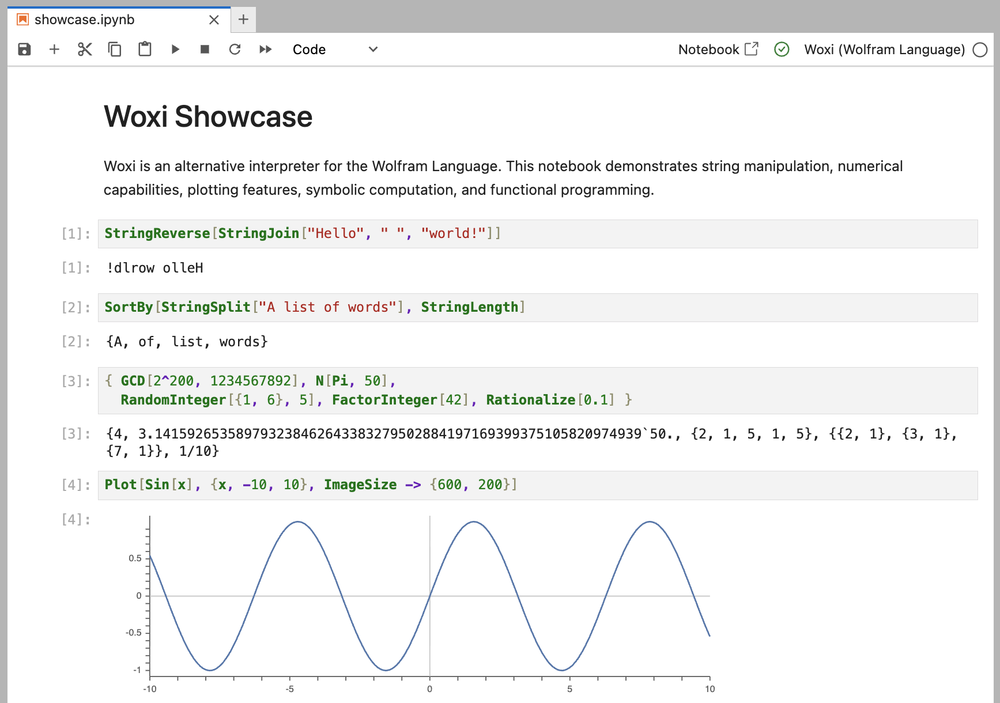

# Woxi

An interpreter for the Wolfram Language powered by Rust.



You can find the official documentation at
[woxi.ad-si.com/docs](https://woxi.ad-si.com/docs/).


## Features

The initial focus is to implement a subset of the Wolfram Language
so that it can be used for CLI scripting and notebooks.
For example:

```wolfram
#!/usr/bin/env woxi

(* Print the square of 5 random integers between 1 and 9 *)
RandomInteger[{1, 9}, 5] // Map[#^2&] // Map[Print]
```

It has full support for Jupyter Notebooks including graphical output:



> [!TIP]
> **Try it out yourself in our
> [JupyterLite instance](https://woxi.ad-si.com/jupyterlite/lab/index.html?path=showcase.ipynb)!**

Check out the [CLI tests](./tests/cli) directory
to see all currently supported commands and their expected output.
All tests must pass with Woxi and WolframScript.

Also check out the [functions.csv](./functions.csv) file
for a list of all Wolfram Language functions and their implementation status.

Woxi runs faster than WolframScript as there is no overhead of starting a kernel
and verifying its license.


## Installation

You can easily install it with [Rust's cargo](https://doc.rust-lang.org/cargo/):

```sh
cargo install woxi
```

### Prebuilt Binaries

Every [GitHub release](https://github.com/ad-si/Woxi/releases) ships archives
of the `woxi` CLI and the Woxi Studio notebook editor for
Linux, macOS, and Windows (x86-64 and arm64),
alongside a `SHA256SUMS.txt` to verify them against.

The macOS build of Woxi Studio comes as a `Woxi Studio.app` bundle.
It is not notarized, so macOS quarantines it after the download —
remove the flag once after unzipping:

```sh
xattr -dr com.apple.quarantine "Woxi Studio.app"
```

#### Verifying a Download

Every archive on a release is built by
[a public GitHub Actions run](./.github/workflows/build-archives.yml)
and carries a signed build provenance attestation.
[GitHub's CLI](https://cli.github.com) checks a download against it:

```sh
gh attestation verify woxi-studio-v0.3.0-x86_64-pc-windows-msvc.zip \
  --repo ad-si/Woxi
```

That confirms the exact file came out of this repository's release workflow —
a stronger guarantee than the `SHA256SUMS.txt` checksums,
which whoever swapped a binary could regenerate too.

#### Windows Defender False Positives

The Windows binaries are not yet code-signed,
so Microsoft Defender's machine-learning heuristics
occasionally flag a fresh release with a generic verdict
such as `Trojan:Win32/Wacatac.B!ml`.
This is a known false positive pattern for unsigned Rust executables
that no scanner has seen before, not a detection of actual malware:
the verdict comes from the file's lack of reputation, not from its contents.

If you hit it, please
[report the file to Microsoft as a false positive](https://www.microsoft.com/en-us/wdsi/filesubmission)
— submissions from affected users are what get the signature corrected —
and [open an issue](https://github.com/ad-si/Woxi/issues) so we can submit it
too. Verify the download with the attestation command above first;
if that check fails, the file did not come from us and should be discarded.

You can always avoid the prebuilt binary entirely
by building from source (see below).

### JavaScript / Node.js

Woxi is also available [on npm as `woxi-wasm`](https://www.npmjs.com/package/woxi-wasm)
as a WebAssembly build with JavaScript bindings (see [npm/](./npm)):

```sh
npm install woxi-wasm
```

```js
import { evaluate } from "woxi-wasm"
evaluate("Plus[1, 2]")  //=> "3"
```

### Python

Woxi is also available [on PyPI](https://pypi.org/project/woxi/)
as a Python package with pre-built wheels:

```sh
pip install woxi
```

```python
import woxi

woxi.interpret("Plus[1, 2]")  # => '3'
```

See [woxi-py/readme.md](woxi-py/readme.md) for the full Python API.


### From Source

If you want to build Woxi from source, you need to have Rust installed.
You can get it from [rust-lang.org](https://www.rust-lang.org/tools/install).

Clone the repository, build the project, and install it:

```sh
git clone https://github.com/ad-si/Woxi
cd Woxi
make install
```

On macOS, `make install` additionally builds the Woxi Studio notebook editor
and installs it as a `.app` bundle at `/Applications/Woxi Studio.app`,
registered with Launch Services so that `.nb`, `.wl`, and `.wls` files appear
under Finder's "Open With…" menu.


## Usage

You can use the interpreter directly from the command line:

```sh
woxi eval "1 + 2"
# 3
```

```sh
woxi eval 'StringJoin["Hello", " ", "World!"]'
# Hello World!
```

Or you can run a script:

```sh
woxi run tests/scripts/hello_world.wls
```

Or start an interactive REPL, where definitions and `%` / `Out[]` history
persist across inputs:

```sh
woxi repl
# In[1]:= x = 5
# Out[1]= 5
# In[2]:= x^2
# Out[2]= 25
```


### Jupyter Notebook

You can also use Woxi in Jupyter notebooks.
Install the kernel with:

```sh
woxi install-kernel
```

Then start the Jupyter server:

```sh
cd examples && jupyter lab
```

Or simply use our
[JupyterLite instance](https://woxi.ad-si.com/jupyterlite/lab/index.html?path=showcase.ipynb).
It runs fully self-contained in your browser and no data is send to the cloud.


## CLI Comparison With [WolframScript]

[WolframScript]: https://www.wolfram.com/wolframscript/index.php.en

Woxi | WolframScript
--- | ---
`woxi eval "1 + 2"` | `wolframscript -code "1 + 2"`
`woxi run script.wls` | `wolframscript script.wls`
`woxi run notebook.nb` | *not supported* (can't run `.nb` files directly)
`woxi repl` | `wolframscript` (no arguments)


## Contributing

Contributions are very welcome!
Please feel free to submit a Pull Request.


### Testing

To run the test suite:

```sh
make test
```
