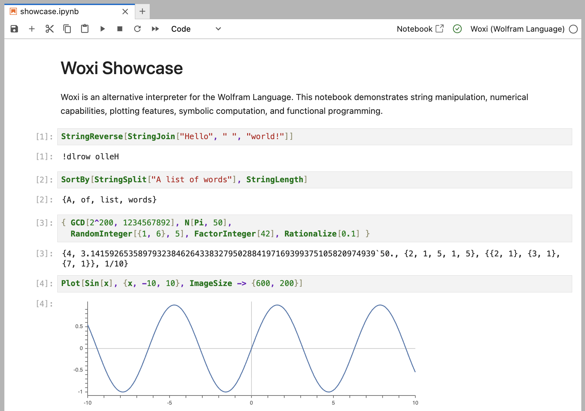

# Woxi

An interpreter for the
[Wolfram Language](https://en.wikipedia.org/wiki/Wolfram_Language)
powered by Rust.

!!! tip

    **Try it instantly in the
    [browser-based playground](/) — no install required.**


## Features

The initial focus is to implement a subset of the Wolfram Language
so that it can be used for CLI scripting and Jupyter notebooks.
For example:

```wolfram
#!/usr/bin/env woxi

(* Print the square of 5 random integers between 1 and 9 *)
RandomInteger[{1, 9}, 5] // Map[#^2&] // Map[Print]
```

It has full support for Jupyter Notebooks including graphical output:



!!! tip

    **Try it out yourself in our
    [JupyterLite instance](/jupyterlite/lab/index.html?path=showcase.ipynb)!**
